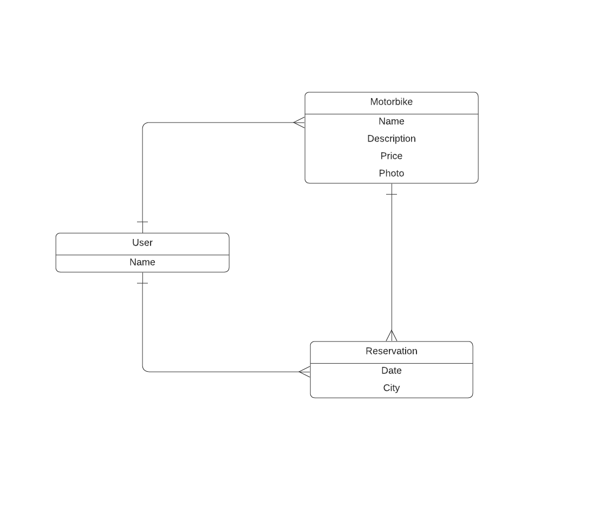

 <a name="readme-top"></a>

<div align="center">
  <h1><b>Motorbikes Booking</b></h1>
</div>

# 📗 Table of Contents

- [📖 About the Project](#about-project)
  - [Kanban Board](#kanban-board)
  - [🛠 Built With ](#-built-with-)
    - [Tech Stack ](#tech-stack-)
    - [Key Features ](#key-features-)
  - [💻 Getting Started ](#-getting-started-)
    - [Prerequisites](#prerequisites)
    - [Setup](#setup)
    - [Install](#install)
    - [Usage](#usage)
    - [Run tests](#run-tests)
  - [👥 Author ](#-author-)
  - [🔭 Future Features ](#-future-features-)
  - [🤝 Contributing ](#-contributing-)
  - [⭐️ Show your support ](#️-show-your-support-)
  - [🙏 Acknowledgments ](#-acknowledgments-)
  - [📝 License ](#-license-)


# 📖 [Motorbikes Booking ] <a name="about-project"></a>

The Backend for Motorbikes Booking app. Built using Ruby on Rails.

# [Kanban Board] <a name="kanban-board"></a>
- Link to [Kanban Board](https://github.com/users/SaneMyburg/projects/5/views/1)
- We are a team of 4 members.
- Link to [Picture of Kanban](https://drive.google.com/file/d/1Q_aer4Fml9QYXLS2aR94h-GbAtVGUdOK/view?usp=drive_link)

# Database Schema <a name="database-schema"></a>
<div align="center">
 
</div>

<p align="right">(<a href="#readme-top">back to top</a>)</p>

## Link to [Front-End Project](https://github.com/SaneMyburg/motorbike-front-end)

<p align="right">(<a href="#readme-top">back to top</a>)</p>

## 🛠 Built With <a name="built-with"></a>

### Tech Stack <a name="tech-stack"></a>

<details>
  <ul>
    <li>Ruby on Rails </li>
  </ul>
</details>


### Key Features <a name="key-features"></a>

- **Authentication**
- **CRUD**
- **Motorbikes Image Upload**

<p align="right">(<a href="#readme-top">back to top</a>)</p>


## 💻 Getting Started <a name="getting-started"></a>

To get a local copy up and running, follow these steps:

- Install Git.
- Install Ruby
- Install Ruby on Rails
- Clone this repo as described in the setup section.
- cd motorbike-back-end
- rails s -p 4000 

### Prerequisites

In order to run this project you need: To clone or fork and run it in a browser

### Setup

Clone this repository to your desired folder:

Example commands:

```sh
  cd my-folder
  git clone https://github.com/SaneMyburg/motorbike-back-end.git
```

For more information on how to clone or fork a repository:
- <a href="https://docs.github.com/en/repositories/creating-and-managing-repositories/cloning-a-repository">How to clone a repo</a>
- <a href="https://docs.github.com/en/get-started/quickstart/fork-a-repo">How to fork a repo</a>

### Install

- Run ` bundle install `
- Run ` bundle exec rails db:create db:migrate `

### Usage

To run the project, execute the following command:

- Run ` bundle exec rails server -p 4000`

### Run tests

To run tests, run the following command:

- to test ruby linter errors  `rubocop`
 
<p align="right">(<a href="#readme-top">back to top</a>)</p>

## 👥 Author <a name="authors"></a>

👤 **Sane Myburg**
- GitHub: [SaneMyburg](https://github.com/SaneMyburg)

👤 **Alishah Safdari**
- GitHub: [@AliShahSafdari](https://github.com/AliShahSafdari)

👤 **Wilhelm Kamulunga**
- GitHub: [@WilhelmK109](https://github.com/wilhelmk109)

👤 **Mohammad**
- GitHub: [@mohametalmeari](https://github.com/mohametalmeari)

## 🔭 Future Features <a name="future-features"></a>

- Email and password authentication
- Authorization
- UX improvements

<p align="right">(<a href="#readme-top">back to top</a>)</p>

## 🤝 Contributing <a name="contributing"></a>

Contributions, issues, and feature requests are welcome!

Feel free to check the [issues page](https://github.com/SaneMyburg/motorbike-back-end/issues).

<p align="right">(<a href="#readme-top">back to top</a>)</p>

## ⭐️ Show your support <a name="support"></a>

Give a ⭐️ if you like this project!

<p align="right">(<a href="#readme-top">back to top</a>)</p>

## 🙏 Acknowledgments <a name="acknowledgements"></a>

- We would like to thank [Microverse](https://www.microverse.org/) for giving us this opportunity.

- We would like to thank [Murat Korkmaz on Behance](https://www.behance.net/gallery/26425031/Vespa-Responsive-Redesign) for the original design.

<p align="right">(<a href="#readme-top">back to top</a>)</p>

## 📝 License <a name="license"></a>

This project is [MIT](./LICENSE) licensed.

<p align="right">(<a href="#readme-top">back to top</a>)</p>